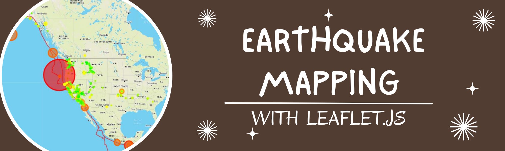
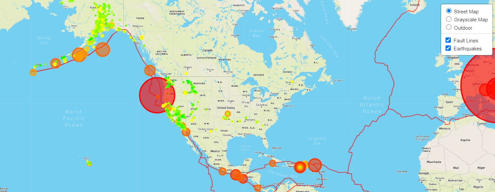

# leaflet-earthquakes

Author:  Erin James Wills, ejw.data@gmail.com  

  
<cite>Photo by Erin Wills</cite>  

 

## Overview

This repo shows how to use leaflet and d3 to map data from a public api.  In this case we are pulling data from the US Geological Survey.

 

## Github Pages  

https://ejw-data.github.io/leaflet-earthquakes/leaflet-step-1/index.html   

https://ejw-data.github.io/leaflet-earthquakes/leaflet-step-2/index.html     

 

## Technologies    
*  HTML/CSS/JS
*  Leaflet.js

 

## Data Source  

https://earthquake.usgs.gov/earthquakes/feed/v1.0/summary/all_week.geojson  

 

## Setup and Installation  
1. Clone the repo to your local machine
1. Open repo folder in an IDE like VSCode
1. Using a virtual server like the VSCode extention LiveServer
1. Run `basic-2/index.html`  

 

## Example

 

